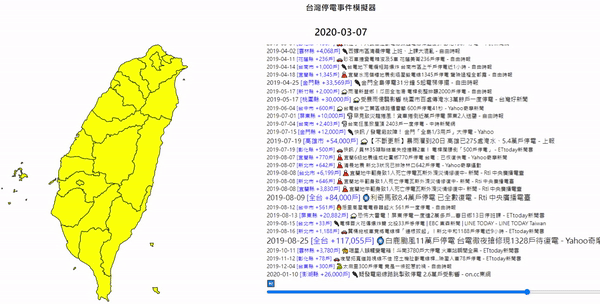

# 台灣停電事件模擬器

## 運行方法
1. 根目錄下執行
    ```python
    python -m http.server 8000
    ```
2. 造訪 http://localhost:8000

## Demo
- 動畫演示

    

- 停電原因符號說明

    


## 如何追加停電資料

1. 安裝環境
    ```pwsh
    # 創建虛擬環境
    python -m venv venv
    
    # 進入虛擬環境
    # Windows
    .\venv\Scripts\Activate.ps1
    # Linux
    source venv/bin/activate

    # 更新 pip
    python -m pip install -U pip

    # 安裝依賴項目
    pip install -r libs/requirements.txt
    pip install -U git+https://github.com/papple23g/mockbrython.git
    ```
2. 爬取當月停電資料
    ```pwsh
    python libs/news.py
    ```

3. 至 `data/news_list.json` 查看新增的資料，並根據新聞連結內容手動追加停電戶數、行政地區、停電原因
    - 例如將
        ```json
        {
            "date": "2024-07-18",
            "title": "高雄六龜大清早就停電！1055戶悶到醒 台電致歉：疑外物碰觸熔絲開關 - Yahoo奇摩新聞",
            "url": "https://news.google.com/rss/articles/CBMiowJodHRwczovL3R3Lm5ld3MueWFob28uY29tLyVFOSVBQiU5OCVFOSU5QiU4NCVFNSU4NSVBRCVFOSVCRSU5QyVFNSVBNCVBNyVFNiVCOCU4NSVFNiU5NyVBOSVFNSVCMCVCMSVFNSU4MSU5QyVFOSU5QiVCQi0xMDU1JUU2JTg4JUI2JUU2JTgyJUI2JUU1JTg4JUIwJUU5JTg2JTkyLSVFNSU4RiVCMCVFOSU5QiVCQiVFOCU4NyVCNCVFNiVBRCU4OS0lRTclOTYlOTElRTUlQTQlOTYlRTclODklQTklRTclQTIlQjAlRTglQTclQjglRTclODYlOTQlRTclQjUlQjIlRTklOTYlOEIlRTklOTclOUMtMDM0MDEwNTQxLmh0bWzSAQA?oc=5&hl=en-US&gl=US&ceid=US:en",
            "households": null,
            "locations": null,
            "reason": null
        },
        ```
        改為
        ```json
        {
            "date": "2024-07-18",
            "title": "高雄六龜大清早就停電！1055戶悶到醒 台電致歉：疑外物碰觸熔絲開關 - Yahoo奇摩新聞",
            "url": "https://news.google.com/rss/articles/CBMiowJodHRwczovL3R3Lm5ld3MueWFob28uY29tLyVFOSVBQiU5OCVFOSU5QiU4NCVFNSU4NSVBRCVFOSVCRSU5QyVFNSVBNCVBNyVFNiVCOCU4NSVFNiU5NyVBOSVFNSVCMCVCMSVFNSU4MSU5QyVFOSU5QiVCQi0xMDU1JUU2JTg4JUI2JUU2JTgyJUI2JUU1JTg4JUIwJUU5JTg2JTkyLSVFNSU4RiVCMCVFOSU5QiVCQiVFOCU4NyVCNCVFNiVBRCU4OS0lRTclOTYlOTElRTUlQTQlOTYlRTclODklQTklRTclQTIlQjAlRTglQTclQjglRTclODYlOTQlRTclQjUlQjIlRTklOTYlOEIlRTklOTclOUMtMDM0MDEwNTQxLmh0bWzSAQA?oc=5&hl=en-US&gl=US&ceid=US:en",
            "households": 1055,
            "locations": [
                "高雄市"
            ],
            "reason": "外物碰觸熔絲開關"
        },
        ```
    ※ 注意: 請勿追加重複事件的新聞資料或國外的停電事件
4. 執行 `pytest -vv -s --disable-warnings` 確認資料格式正確:
    - 縣市名稱: 需要為以下之一
        ```
        '基隆市', '台東縣', '苗栗縣', '宜蘭縣', '新竹縣', '花蓮縣', '金門縣', '屏東縣', '新竹市', '雲林縣', '台南市', '嘉義縣', '台中市', '高雄市', '新北市', '苗栗市', '台北市', '南投縣', '彰化縣', '連江縣', '嘉義市', '桃園縣', '澎湖縣'
        ```
    - 停電原因: 需包含 `libs/reason_emoji.py` 裡的任一個關鍵字

5. 完成
